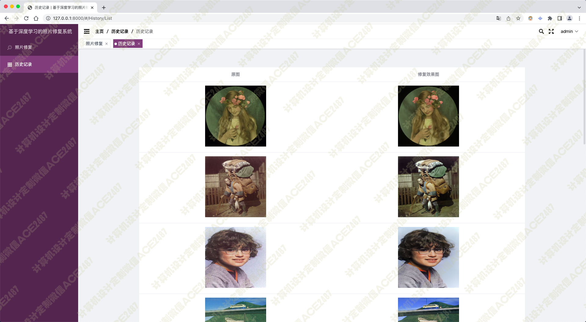
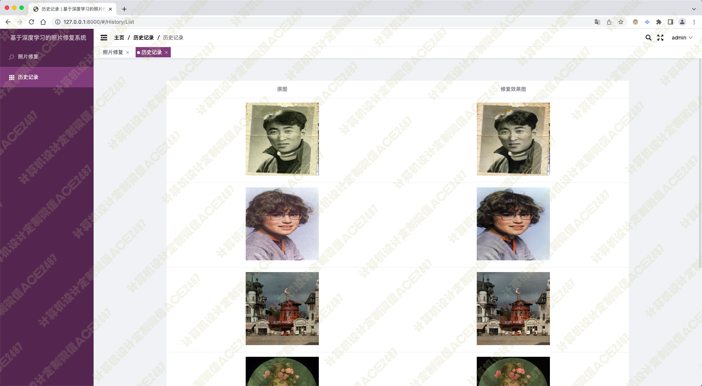
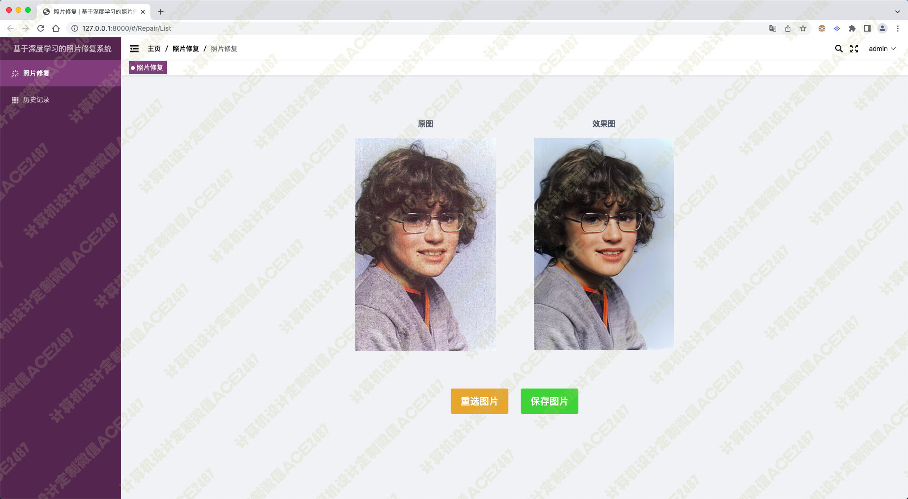
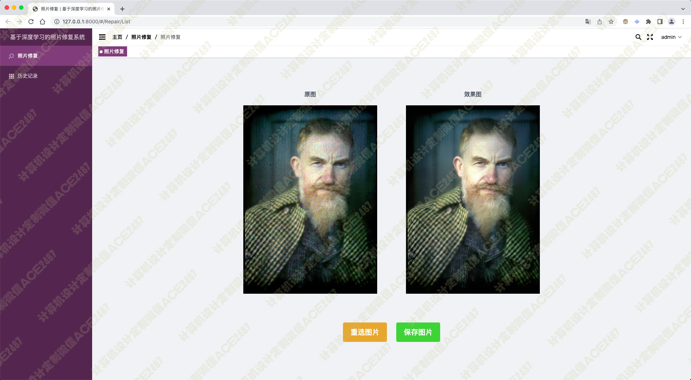
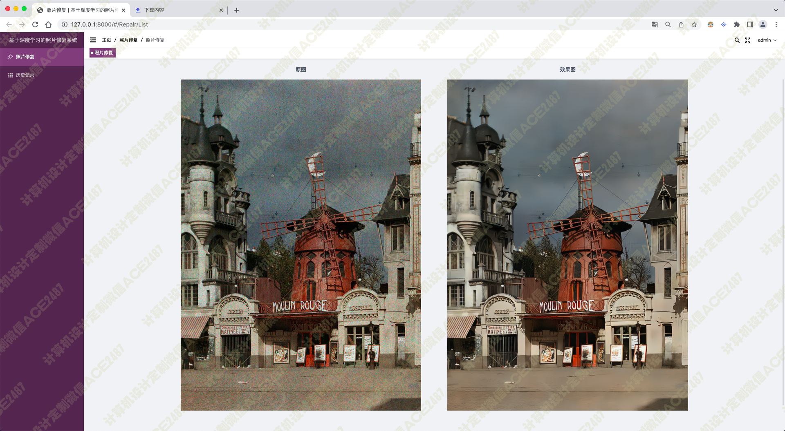
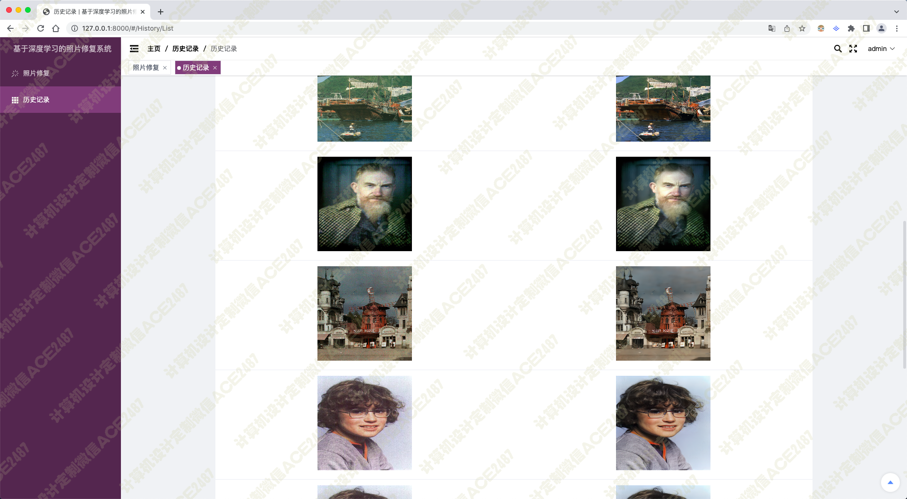
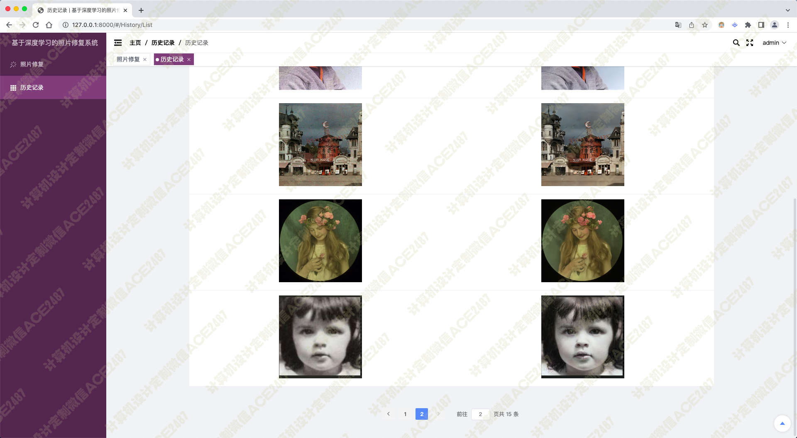

# 012 基于深度学习的老照片修复系统-设计源码展示

> **代码有偿获取 可接受定制 微信联系方式: ACE2487，备注(BS)**

> 

## 技术栈

深度学习 pytorch tensorflow python 卷积神经 神经网络 照片修复 vue 老照片修复

扫描褪色 残损照片或胶片 调整暗调/高光以改善面效果 修正曝光斑痕

## 视频

> **点击查看 \>\>\> [https://www.bilibili.com/video/BV1dY411M71g/](https://www.bilibili.com/video/BV1dY411M71g/)**

## 截图

